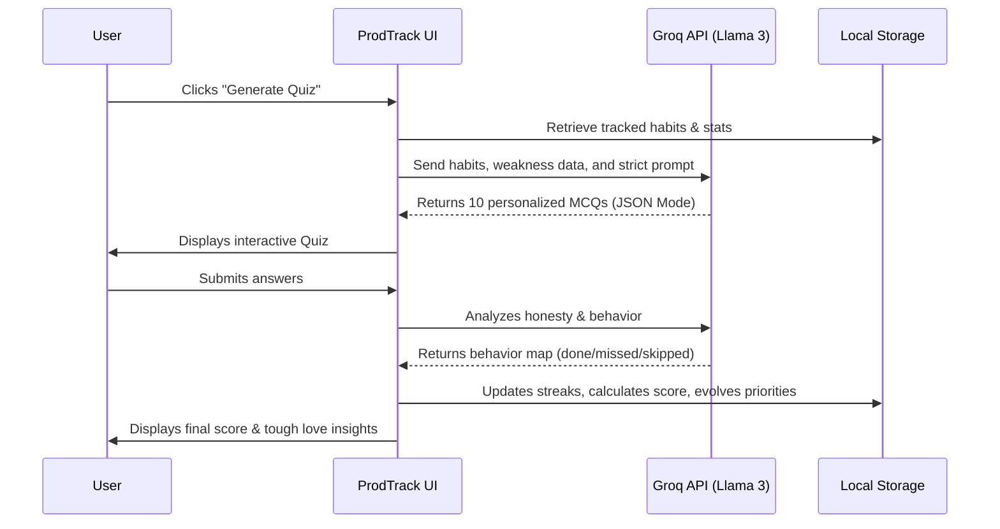
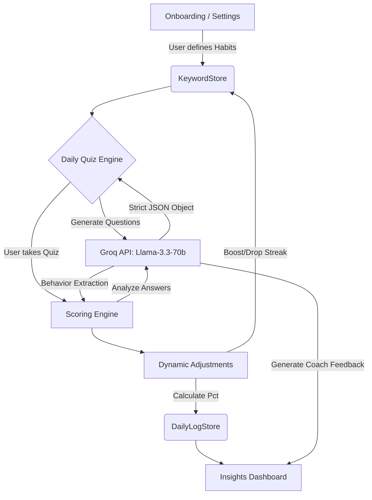

  
⚡

  <h1>ProdTrack AI 🧠</h1>
  
<strong>A strict, no-nonsense AI productivity coach that actually holds you accountable.</strong>

---

## 🤔 The Problem with Normal Habit Trackers
Most habit trackers are just dumb checklists. You check off "Gym", "Leetcode", or "Reading," and get a dopamine hit. 

But when you fail? Nothing happens. When you get distracted? The app just ignores it. Existing apps *passively record* your behavior but never challenge you. It’s way too easy to lie to a checkbox.

## 🚀 The ProdTrack Intuition
**ProdTrack** flips the script. Instead of checking boxes, you face a **Daily AI Check-in Quiz**. 

Powered by Meta's **Llama 3 70B** through the blazing-fast Groq API, ProdTrack acts as a tough, observant coach. You tell it what your goals are (streaks) and what your weaknesses are (distractions). Every single day, the AI generates **10 highly personalized MCQ questions** to dynamically audit your behavior.

Instead of asking *"Did you study?"*, it asks:
*"Yesterday you completely caved to mindless scrolling. Did you actually open your textbook today, or did your phone win again?"*

---

## 🛠️ How It Works (The Workflow)

ProdTrack is a **local-first web application** built with React, Vite, and completely serverless AI integration.

### The Daily Loop
1. **The Setup:** You define your `streaks` (e.g., Leetcode, Gym) and `distractions` (e.g., Instagram, Procrastination).
2. **The Generation:** The AI creates 10 tough, context-aware questions targeting your specific behavior patterns.
3. **The Confession:** You answer the questions honestly.
4. **The Analysis:** The AI engine grades your answers, deducts points for distractions, boosts your streak score, and generates hard-hitting insights.

---

## 💡 Why This is More Effective
* **Dynamic Interrogation:** You can't just auto-pilot a checkbox. You have to read the question and actively admit if you failed or succeeded.
* **Smart Memory System:** If you miss a habit 3 days in a row, the `ScoringEngine` automatically raises its priority. The AI will start grilling you harder on that specific topic the next day.
* **Negative Reinforcement:** Distractions literally subtract from your daily score. 
* **Privacy First:** 100% of your tracking data stays entirely in your browser's local storage. Only the prompts are sent to the AI.
* **Lightning Fast:** By utilizing Groq's Llama-3 inference, the complex logical processing happens in milliseconds.

---

## 🏗️ Architecture Flow

## 🚀 Getting Started

1. **Clone the repo**
2. **Install dependencies:** `npm install`
3. **Start the local server:** `npm run dev`
4. **Get a free Groq API key:** Visit [console.groq.com](https://console.groq.com)
5. **Open the app** (usually at `http://localhost:5173`) and paste your API key in the onboarding flow.

Get ready to actually be held accountable. Happy tracking! ⚡
